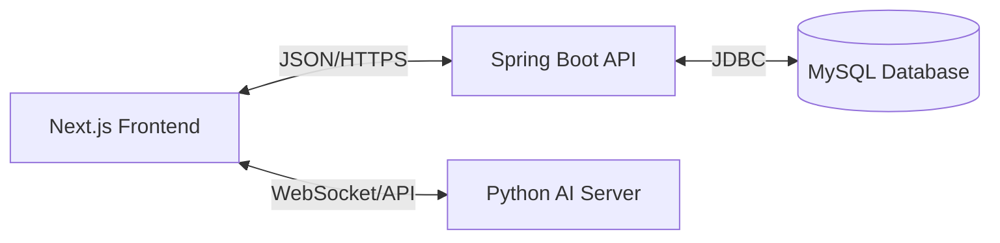

# 🎮 GameHub

> **The ultimate social platform for gamers to discover, track, and review their favorite titles.**

## 📖 About The Project

**GameHub** is a modern, full-stack web application designed for the gaming community. It bridges the gap between game discovery and social interaction, allowing users to build their personal library, write detailed reviews, and engage with other gamers through a dynamic feed.

Built with performance and scalability in mind, GameHub leverages a robust **Spring Boot** backend and a reactive **Next.js** frontend to deliver a seamless user experience.

---

## ✨ Key Features

*   **🔍 Smart Discovery**: Browse a curated collection of popular games with advanced search and filtering.
*   **📚 Personal Library**: Manage your "Owned" and "Wishlist" games with platform-specific tracking.
*   **✍️ Rich Reviews**: Share your thoughts with a 5-star rating system, detailed text, and recommendation status.
*   **🤖 AI Review Analysis**: **GPT-5.1 Powered** summary engine that aggregates thousands of reviews into concise insights.
*   **💬 AI Chat Agent**: Interactive "Game Master" chatbot that helps you discover games and answers generic gaming questions.
*   **👤 User Profiles**: Showcase your gaming journey with detailed stats, collection insights, and review history.
*   **🔐 Secure Access**: Fully authenticated experience using JWT (JSON Web Tokens) and BCrypt encryption.

---

## 🛠️ Technology Stack

### Frontend
*   **Framework**: Next.js 14 (App Router)
*   **Language**: TypeScript
*   **Styling**: Tailwind CSS + Custom Animations
*   **State**: React Hooks
*   **AI Integration**: OpenAI API (Chatbot)

### Backend
*   **Core**: Spring Boot 3.2
*   **Language**: Java 17+
*   **Database**: MySQL 8.0
*   **Security**: Spring Security + JWT
*   **Build**: Maven

### Infrastructure
*   **Containerization**: Docker
*   **Version Control**: Git

---

## 🏗️ Architecture Overview

GameHub follows a clean **RESTful architecture**:

*   **Frontend**: Handles UI/UX, client-side routing, and API integration.
*   **Backend**: Manages business logic, authentication, and data persistence.
*   **Database**: Stores relational data for users, games, reviews, and activities.
*   **AI Server**: A lightweight Python Flask server handling Chatbot and Review summarization.

---

## 🚀 Getting Started

For detailed installation and startup instructions, please refer to the specific guides below:

*   👉 **[Run Guide (RUN_GUIDE.md)](./RUN_GUIDE.md)**: The "Golden Path" to get the project running perfectly.
*   👉 **[Manual Generation Guide (MANUAL_GENERATION_GUIDE.md)](./MANUAL_GENERATION_GUIDE.md)**: How to generate more AI data.
*   👉 **[Testing Guide (TESTING.md)](./TESTING.md)**: Manual and API testing checklists.
