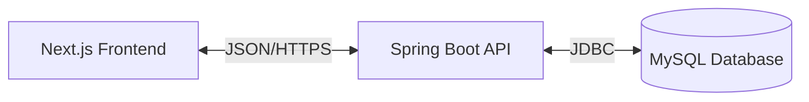

# 🎮 GameHub

> **The ultimate social platform for gamers to discover, track, and review their favorite titles.**

## 📖 About The Project

**GameHub** is a modern, full-stack web application designed for the gaming community. It bridges the gap between game discovery and social interaction, allowing users to build their personal library, write detailed reviews, and engage with other gamers through a dynamic feed.

Built with performance and scalability in mind, GameHub leverages a robust **Spring Boot** backend and a reactive **Next.js** frontend to deliver a seamless user experience.

---

## ✨ Key Features

*   **🔍 Smart Discovery**: Browse a curated collection of popular games with advanced search and filtering.
*   **📚 Personal Library**: Manage your "Owned" and "Wishlist" games with platform-specific tracking.
*   **✍️ Rich Reviews**: Share your thoughts with a 5-star rating system, detailed text, and recommendation status.
*   **💬 Social Engagement**: Like reviews, reply to comments, and view real-time activity feeds from the community.
*   **👤 User Profiles**: Showcase your gaming journey with detailed stats, collection insights, and review history.
*   **🔐 Secure Access**: Fully authenticated experience using JWT (JSON Web Tokens) and BCrypt encryption.

---

## 🛠️ Technology Stack

### Frontend
*   **Framework**: Next.js 16 (App Router)
*   **Language**: TypeScript
*   **Styling**: Tailwind CSS + Custom Animations
*   **State**: React Hooks

### Backend
*   **Core**: Spring Boot 3.2
*   **Language**: Java 17+
*   **Database**: MySQL 8.0
*   **Security**: Spring Security + JWT
*   **Build**: Maven

### Infrastructure
*   **Containerization**: Docker
*   **Version Control**: Git

---

## 🏗️ Architecture Overview

GameHub follows a clean **RESTful architecture**:

*   **Frontend**: Handles UI/UX, client-side routing, and API integration.
*   **Backend**: Manages business logic, authentication, and data persistence.
*   **Database**: Stores relational data for users, games, reviews, and activities.

---

## 🚀 Getting Started

Want to run GameHub locally? We've separated the technical setup and testing instructions into a dedicated guide.

👉 **[Read the Testing & Setup Guide (TESTING.md)](./TESTING.md)**

